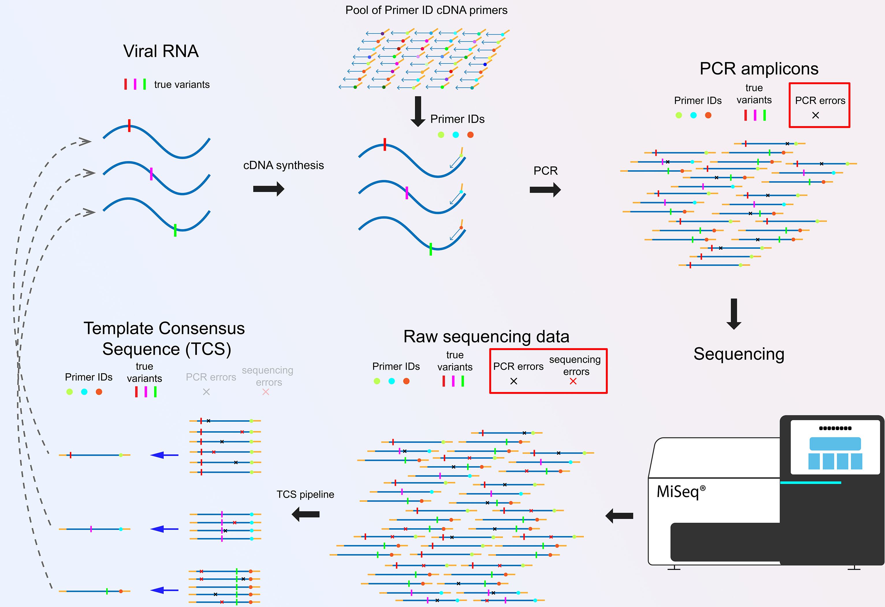

# ViralSeq

[](https://rubygems.org/gems/viral_seq)


[](https://gitter.im/viral_seq/community?utm_source=badge&utm_medium=badge&utm_campaign=pr-badge&utm_content=badge)

A Ruby Gem containing bioinformatics tools for processing viral NGS data.

Specifically for Primer ID sequencing and HIV drug resistance analysis.

#### tcs web app - https://primer-id.org/

## Illustration for the Primer ID Sequencing




### Reference readings on the Primer ID sequencing
[Explantion of Primer ID sequencing](https://doi.org/10.21769/BioProtoc.3938)  
[Primer ID MiSeq protocol](https://doi.org/10.1128/JVI.00522-15)  
[Application of Primer ID sequencing in COVID-19 research](https://doi.org/10.1126/scitranslmed.abb5883)

## Install

```bash
    $ gem install viral_seq
```

## Usage

### Excutables

### `tcs`  
Use executable `tcs` pipeline to process **Primer ID MiSeq sequencing** data.

Web-based `tcs` analysis can be accessed at https://primer-id.org/

Example commands:
```bash
    $ tcs -p params.json # run TCS pipeline with params.json
    $ tcs -p params.json -i DIRECTORY
    # run TCS pipeline with params.json and DIRECTORY
    # if DIRECTORY is not defined in params.json
    $ tcs -dr -i DIRECTORY
    # run tcs-dr (MPID HIV drug resistance sequencing) pipeline
    # DIRECTORY needs to be given.
    $ tcs -j # CLI to generate params.json
    $ tcs -h # print out the help
```

[sample params.json for the tcs-dr pipeline](./docs/dr.json)

---
### `tcs_log`

Use `tcs_log` script to pool run logs and TCS fasta files after one batch of `tcs` jobs.


Example file structure:  
```
batch_tcs_jobs/  
      ├── lib1  
      ├── lib2  
      ├── lib3  
      ├── lib4  
      ├── ...  
```

Example command:
```bash
    $ tcs_log batch_tcs_jobs
```

---
### `tcs_sdrm`

Use `tcs_sdrm` pipeline for HIV-1 drug resistance mutation and recency.

Example command:
```bash
    $ tcs_sdrm libs_dir
```

lib_dir file structure:
```
libs_dir/
├── lib1
  ├── lib1_RT
  ├── lib1_PR
  ├── lib1_IN
  ├── lib1_V1V3
├── lib2
  ├── lib1_RT
  ├── lib1_PR
  ├── lib1_IN
  ├── lib1_V1V3
├── ...
```

Output data in a new dir as 'libs_dir_SDRM'


**Note: [R](https://www.r-project.org/) and the following R libraries are required:**
- phangorn
- ape
- scales
- ggforce
- cowplot
- magrittr
- gridExtra

---

### `locator`  
Use executable `locator` to get the coordinates of the sequences on HIV/SIV reference genome from a FASTA file through a terminal

```bash
    $ locator -i sequence.fasta -o sequence.fasta.csv
```
---

## Some Examples

Load all ViralSeq classes by requiring 'viral_seq.rb' in your Ruby scripts.

```ruby
#!/usr/bin/env ruby
require 'viral_seq'
```

Load nucleotide sequences from a FASTA format sequence file

```ruby
my_seqhash = ViralSeq::SeqHash.fa('my_seq_file.fasta')
```

Make an alignment (using MUSCLE)

```ruby
aligned_seqhash = my_seqhash.align
```

Filter nucleotide sequences with the reference coordinates (HIV Protease)

```ruby
qc_seqhash = aligned_seqhash.hiv_seq_qc(2253, 2549, false, :HXB2)
```

Further filter out sequences with Apobec3g/f hypermutations

```ruby
qc_seqhash = qc_seqhash.a3g[:filtered_seq]
```

Calculate nucleotide diveristy π

```ruby
qc_seqhash.pi
```

Calculate cut-off for minority variants based on Poisson model

```ruby
cut_off = qc_seqhash.pm
```

Examine for drug resistance mutations for HIV PR region

```ruby
qc_seqhash.sdrm_hiv_pr(cut_off)
```
## Known issues

  1. ~~have a conflict with rails.~~
  2. ~~Update on 03032021. Still have conflict. But in rails gem file, can just use `requires: false` globally and only require "viral_seq" when the module is needed in controller.~~
  3. The conflict seems to be resovled. It was from a combination of using `!` as a function for factorial and the gem name `viral_seq`. @_@

## Updates

### Version 1.2.6-07122021

  1. Optimized the workflow of the `tcs` pipeline in the "end-join/QC/Trimming" section.
  `tcs` version to v2.3.5.


### Version 1.2.5-06232021

  1. Add error rescue and report in the `tcs` pipeline.
    error messages are stored in the .tcs_error file. `tcs` pipeline updated to v2.3.4.
  2. Use simple majority for the consensus cut-off in the default setting of the `tcs -dr` pipeline.

### Version 1.2.2-05272021

  1. Fixed a bug in the `tcs` pipeline that sometimes causes `SystemStackError`.
  `tcs` pipeline upgraded to v2.3.2

### Version 1.2.1-05172021

  1. Added a function in R to check and install missing R packages for `tcs_sdrm` pipeline.

### Version 1.2.0-05102021

  1. Added `tcs_sdrm` pipeline as an excutable.
  `tcs_sdrm` processes `tcs`-processed HIV MPID-NGS data for drug resistance mutations, recency and phylogentic analysis.

  2. Added function ViralSeq::SeqHash#sample.

  3. Added recency determining function `ViralSeq::Recency::define`

  4. Fixed a few bugs related to `tcs_sdrm`.

### Version 1.1.2-04262021

  1. Added function `ViralSeq::DRMs.sdrm_json` to export SDRM as json object.
  2. Added a random string to the temp file names for `muscle_bio` to avoid issues when running scripts in parallel.
  3. Added `--keep-original` flag to the `tcs` pipeline.

### Version 1.1.1-04012021

  1. Added warning when paired_raw_sequence less than 0.1% of total_raw_sequence.
  2. Added option `-i WORKING_DIRECTORY` to the `tcs` script.
  If the `params.json` file does not contain the path to the working directory, it will append path to the run params.
  3. Added option `-dr` to the `tcs` script.

### Version 1.1.0-03252021

  1. Optimized the algorithm of end-join.
  2. Fixed a bug in the `tcs` pipeline that sometimes combined tcs files are not saved.
  3. Added `tcs_log` command to pool run logs and tcs files from one batch of tcs jobs.
  4. Added the preset of MPID-HIVDR params file [***dr.json***](./docs/dr.json) in /docs.
  5. Add `platform_format` option in the json generator of the `tcs` Pipeline.
  Users can choose from 3 MiSeq platforms for processing their sequencing data.
  MiSeq 300x7x300 is the default option.

### Version 1.0.14-03052021

  1. Add a function `ViralSeq::TcsCore.validate_file_name` to check MiSeq paired-end file names.

### Version 1.0.13-03032021

  1. Fixed the conflict with rails.

### Version 1.0.12-03032021

  1. Fixed an issue that may cause conflicts with ActiveRecord.

### Version 1.0.11-03022021

  1. Fixed an issue when calculating Poisson cutoff for minority mutations `ViralSeq::SeqHash.pm`.
  2. fixed an issue loading class 'OptionParser'in some ruby environments.

### Version 1.0.10-11112020:

  1. Modularize TCS pipeline. Move key functions into /viral_seq/tcs_core.rb
  2. `tcs_json_generator` is removed. This CLI is delivered within the `tcs` pipeline, by running `tcs -j`. The scripts are included in the /viral_seq/tcs_json.rb
  3. consensus model now includes a true simple majority model, where no nt needs to be over 50% to be called.
  4. a few optimizations.
  5. TCS 2.1.0 delivered.
  6. Tried parallel processing. Cannot achieve the goal because `parallel` gem by default can't pool data from memory of child processors and `in_threads` does not help with the speed.

### Version 1.0.9-07182020:

  1. Change ViralSeq::SeqHash#stop_codon and ViralSeq::SeqHash#a3g_hypermut return value to hash object.

  2. TCS pipeline updated to version 2.0.1. Add optional `export_raw: TRUE/FALSE` in json params. If `export_raw` is `TRUE`, raw sequence reads (have to pass quality filters) will be exported, along with TCS reads.

### Version 1.0.8-02282020:

  1. TCS pipeline (version 2.0.0) added as executable.
      tcs  -  main TCS pipeline script.
      tcs_json_generator  -  step-by-step script to generate json file for tcs pipeline.

  2. Methods added:
      ViralSeq::SeqHash#trim

  3. Bug fix for several methods.

### Version 1.0.7-01282020:

  1. Several methods added, including
      ViralSeq::SeqHash#error_table
      ViralSeq::SeqHash#random_select
  2. Improved performance for several functions.

### Version 1.0.6-07232019:

  1. Several methods added to ViralSeq::SeqHash, including
      ViralSeq::SeqHash#size
      ViralSeq::SeqHash#+
      ViralSeq::SeqHash#write_nt_fa
      ViralSeq::SeqHash#mutation
  2. Update documentations and rspec samples.

### Version 1.0.5-07112019:

  1. Update ViralSeq::SeqHash#sequence_locator.
     Program will try to determine the direction (`+` or `-` of the query sequence)
  2. update executable `locator` to have a column of `direction` in output .csv file

### Version 1.0.4-07102019:

  1. Use home directory (Dir.home) instead of the directory of the script file for temp MUSCLE file.
  2. Fix bugs in bin `locator`

### Version 1.0.3-07102019:

  1. Bug fix.

### Version 1.0.2-07102019:

  1. Fixed a gem loading issue.

### Version 1.0.1-07102019:

  1. Add keyword argument :model to ViralSeq::SeqHashPair#join2.
  2. Add method ViralSeq::SeqHash#sequence_locator (also: #loc), a function to locate sequences on HIV/SIV reference genomes, as HIV Sequence Locator from LANL.
  3. Add executable 'locator'. An HIV/SIV sequence locator tool similar to LANL Sequence Locator.
  4. update documentations

### Version 1.0.0-07092019:

  1. Rewrote the whole ViralSeq gem, grouping methods into modules and classes under main Module::ViralSeq

## Development

Bug reports and pull requests are welcome on GitHub at https://github.com/ViralSeq/viral_seq. This project is intended to be a safe, welcoming space for collaboration, and contributors are expected to adhere to the [Contributor Covenant](http://contributor-covenant.org) code of conduct.

## License

The gem is available as open source under the terms of the [MIT License](https://opensource.org/licenses/MIT).

## Code of Conduct

Everyone interacting in the viral_seq project’s codebases, issue trackers, chat rooms and mailing lists is expected to follow the [code of conduct](https://github.com/ViralSeq/viral_seq/blob/master/CODE_OF_CONDUCT.md).
